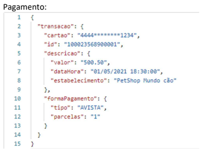
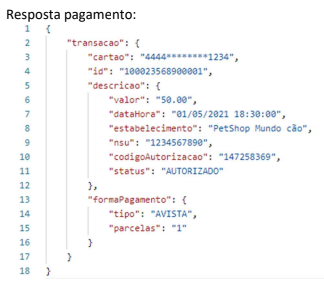
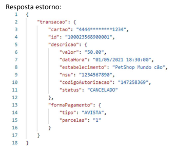

# Implementação de uma API para um processo seletivo

## Objetivo
Implementar uma API de Pagamentos com as seguintes operações:
- Pagamento:
    - Solicitação
    - resposta conforme JSON abaixo

    
    
    
- Estorno:
    - consulta: por ID
    - retorno: conforme JSON de retorno de estorno (status CANCELADO)

    

- Consulta:
    - consulta: todos e por ID
    - retorno: conforme JSON de retorno do pagamento
    
## Requisitos das transações:
- Transacao > id: Deve ser único
- Transacao > Status: “AUTORIZADO”, “NEGADO” (e CANCELADO)
- formaPagamento > Tipo: “AVISTA”, “PARCELADO LOJA”, “PARCELADO EMISSOR”

## Outros Requisitos
- Uso de Orientação objetos
- Tratamento de exceções
- Validação de dados
- Testes Unitários
- Usar Git para versionamento
- Padrões de Projeto
- Não há necessidade de persistir os dados em um banco de dados.

## Como implementei
- Utilizei o Spring Boot para o desenvolvimento da API.
- Utilizei o padrão de projeto MVC, com as camadas: Controller, DTO, Servico, DAO, Model.
- Tratei Pagamento e Estorno como transação. A diferença entre estas entidades são os valores possíveis para status [AUTORIZADO, NEGADO] ou [CANCELADO]. Esse status é representado pelo enum StatusTransacao.
- Defini as seguintes entidades: **Transacao**, **FormaPagamento** e **DescricaoTransacao**.

Existe, basicamente, um único: ``/transacao.``
- Para **consulta**, use ``/transacao`` ou ``/transacao/``{``id``} 
- Para consulta de **estorno**, ``/transacao/estorno`` ou ``/transacao/estorno/``{``id``}
- Para consulta de **pagamentos**, ``/transacao/pagamento`` ou ``/transacao/pagamentos/``{``id``}
- Para **solicitar** um pagamento, faça um POST para ``/transacao/pagamento``, com o seguinte JSON, por exemplo. 

        {
            "cartao": "999999999999999",
            "descricao": "Teste 2",
            "valor": "500.50",
            "formaPagamento": 1,
            "parcelas": "11"
        }
    Como resultado da solicitação, será retornado, por exemplo, o seguinte JSON, com o Status podendo ser AUTORIZADO OU NEGADO e outras informações do pagamento:

        {
            "id": 1,
            "cartao": "999999999999999",
            "descricao": {
                "valor": "500,50",
                "data": "23/12/2021 19:15:17",
                "estabelecimento": "Teste 2",
                "nsu": "123123123",
                "codigoAutorizacao": "123123",
                "status": "NEGADO"
            },
            "formaPagamento": {
                "tipo": "AVISTA",
                "parcelas": 1
            }
        }

## Como rodar
```
git clone https://github.com/PhilippeBrissant/portfolio.git

cd portfolio/processo-seletivo1

./mvnw spring-boot:run
```

## Meu ambiente
- VSCode 
- java 8
- Extensão Thunder Client (no lugar do Postman)

## Outras observações
- Os testes unitários podem ser encontrados em ``/test/java/API/``.
- Acabei implementando operações não solicitadas, como consulta todos pagamentos e estornos.

## References

- [Spring Boot Docs](https://spring.io/projects/spring-boot)
- [Curso Alura de Spring Boot 1](https://cursos.alura.com.br/course/spring-boot-api-rest)
- [Curso Alura de Spring Boot 3](https://cursos.alura.com.br/course/spring-boot-profiles-testes-deploy)